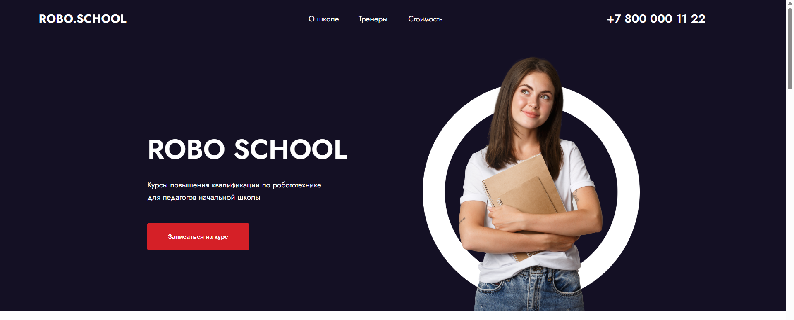
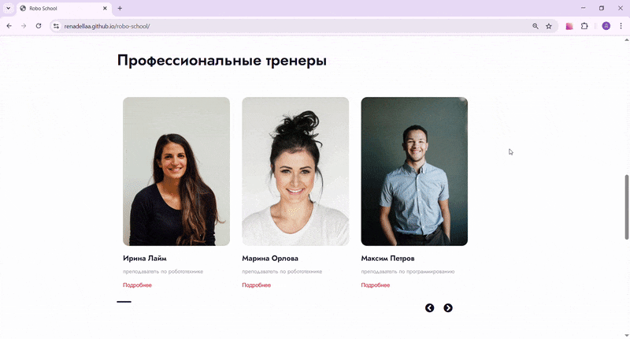
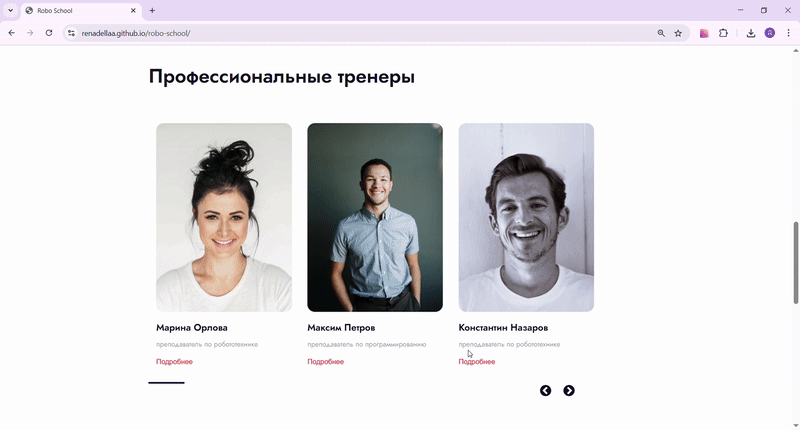
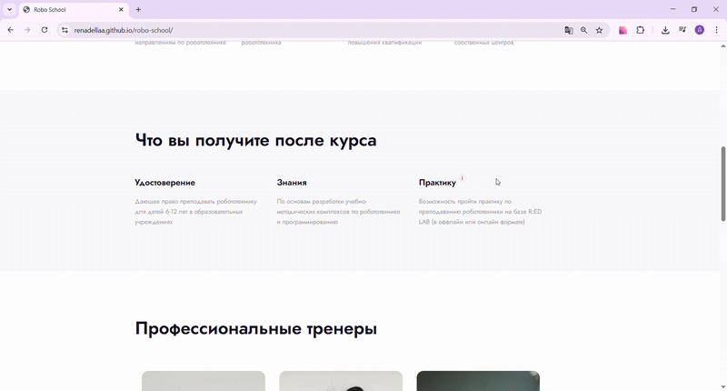
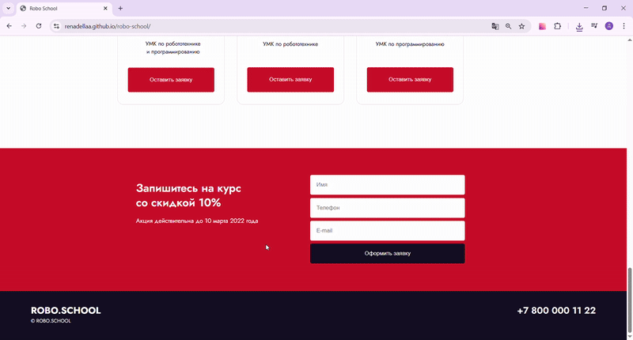

<h2>1. Название проекта</h2>

Robo School

<h2>2. Описание проекта</h2>

Robo School - это сайт школы по повышению квалификации в сфере робототехники и программирования. Сайт выполнен на React + Vite. Проект создавался на основе макета из Figma. На сайте реализовано модальное окно, тултипы, валидация форм.

  <strong>Ссылки на макет</strong>
   
  <a href='https://www.figma.com/design/bSxMNm0CRXFcHQzke8C8W5/ROBO-SCHOOL?node-id=0-1&p=f&t=Gmszg8I6kDLwJvrg-0'>Robo-School.Figma</a>
   
  <a href='https://live.verstaem.online/robo-school/'>Robo-School.Live-превью</a>

  <strong>Ссылка на проект</strong>
   
  <a href='https://renadellaa.github.io/robo-school/'>Robo School</a>

<h2>3. Технологии</h2>

  
  
  
  
  

<h2>4. Процесс создания</h2>

Работа разделена на 6 этапов:

<ol>
  <li>Анализ макета. Просмотр и подгрузка основных шрифтов и их начертаний.</li>
  <li>Установка React + Vite.</li>
  <li>Разбивка макета на функциональные компоненты, соблюдая SRP (принцип единственной ответственности).</li>
  <li>Данные для сайта я взяла из массива объектов, хранящихся локально.</li>
  <li>Разработка модального окна.</li>
  <li>Валидация форм.</li>
</ol>
<h2>5. Функционал</h2>

  
Модальное окно

  

  
Слайдер

  

  
Тултип

  

  
Валидация форм

  

<h2>6. Планы по улучшению</h2>
<ol>
  <li>Добавить адаптив.</li>
</ol>
